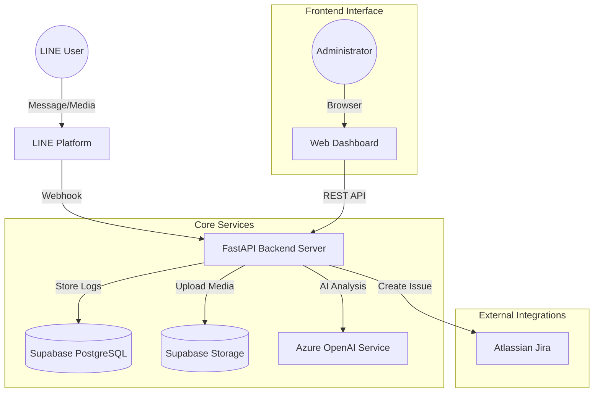
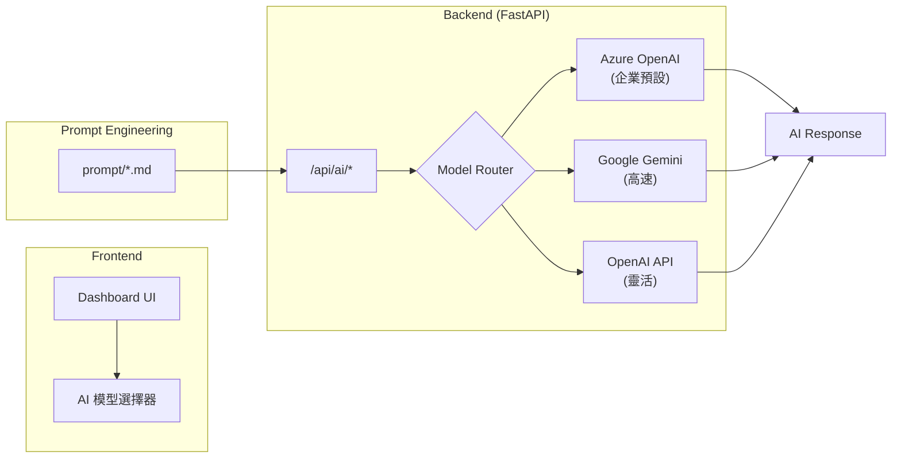

> **Version**: 2.9 (API-First Architecture & UI Enhancement)
> **Date**: 2025-12-24
> **Authors**: AI Architect Team
> **Status**: Production Ready for Deployment

---

## 1. 產品願景與目標 (Product Vision)
本專案旨在建立一個企業級的 LINE Bot 解決方案，作為團隊協作的智慧中樞。透過自動化收集、分析與整合 LINE 群組內的溝通內容，並與企業工單系統 (Jira) 及雲端儲存 (Supabase) 無縫串接，大幅降低專案經理與工程團隊的資訊同步成本。

### 核心價值
*   **資訊集中化**：自動備份對話紀錄與多媒體檔案，避免 LINE 資料過期丟失。
*   **決策智慧化**：利用 Azure OpenAI 進行每日對話摘要與關鍵議題提取。
*   **流程自動化**：一鍵將對話轉為 Jira 工單，包含完整上下文與附檔，提升報修與追蹤效率。
*   **可視化管理**：提供 RWD 響應式儀表板，即時監控群組活躍度與議題趨勢。

## 2. 系統架構 (System Architecture)

本系統採用微服務概念的模組化設計，以後端 FastAPI 為核心，串接多方外部 API。



### 技術堆疊 (Tech Stack)
*   **Backend Framework**: Python 3.12 + FastAPI (High performance async framework)
*   **Database**: Supabase (PostgreSQL)
*   **Object Storage**: Supabase Storage (S3-compatible)
*   **AI Engine**: Multi-Model Support (Azure OpenAI / Google Gemini / OpenAI)
*   **Frontend**: HTML5, Bootstrap 5, Jinja2 Templates, Vanilla JS
*   **Visualization**: Chart.js, chartjs-plugin-datalabels
*   **Deployment**: Uvicorn ASGI Server
*   **Testing**: pytest, pytest-json-report

### 前端架構 (Frontend Architecture) **[NEW v2.7]**

**[Refactored]** Dashboard 前端已從單一 HTML 文件重構為模組化架構，提升可維護性與開發效率。

```
lineBotMvp/
├── static/                          # 靜態資源目錄
│   ├── css/
│   │   └── dashboard.css           # 外部 CSS 樣式 (~10KB)
│   └── js/
│       └── dashboard-all.js        # 外部 JavaScript (~220KB)
├── templates/
│   └── dashboard.html              # 精簡後的模板 structure
└── main.py                         # FastAPI StaticFiles Mount
```

**重構成果**:
| 項目 | 變化 |
|------|------|
| `dashboard.html` | 7160 行 → ~1774 行 (減少 75%) |
| CSS | 內嵌 → 獨立 `dashboard.css` |
| JavaScript | 內嵌 → 獨立 `dashboard-all.js` |

**資料傳遞機制**:
Jinja2 模板變數透過 `window.DASHBOARD_DATA` 全局物件傳遞給外部 JavaScript。
> **注意**: 由於 Jinja2 語法容易受編輯器影響，未來建議重構為 API-First 的數據獲取模式。

## 3. 功能模組規格 (Feature Specifications)

### 3.1 LINE 訊息處理 (Message Handling)
*   **Webhook 接收**: 支援 `text`, `image`, `video` 訊息事件。
*   **媒體處理**:
    *   **安全存取**: 圖片與影片自動下載並上傳至 Supabase Storage `chat-assets` bucket。
    *   **動態簽名 (Dynamic Signed URL)**: **[Enhanced v2.4]** 實作動態獲取機制，點擊預覽或下載時才向後端請求短效期的安全連結 (60秒)，解決靜態連結過期問題並提升資安等級。
*   **資料保存**: 所有訊息與 metadata (User ID, Group ID, Timestamp) 寫入 `chat_logs` 資料表。

### 3.2 管理儀表板 (Admin Dashboard)
*   **存取控制**: 基於 Session 的簡易登入機制 (Admin User/Pass)。
*   **即時時鐘 (Live Clock)**: 導覽列顯示即時系統時間，格式為 `YYYY-MM-DD HH:mm:ss DayName(中文星期)`，每秒自動更新。
*   **數據檢視**:
    *   **多維度篩選**: 
        *   支援日期範圍查詢、群組 ID 篩選。
        *   **日期範圍快捷選單 (Shortcuts)**: 提供「今日」、「昨日」、「前三天」、「本週」、「本月」快速設定。
    *   **[New v2.7] AI 摘要檢視入口**: 
        *   將「檢視 AI 摘要」功能移至 **右上角 Admin 用戶下拉選單**，優化頂部空間配置。
        *   篩選列保留「AI 摘要」生成按鈕，職責分離更明確。
    *   **即時圖表 (可收合/展開)**:
        *   **視覺化卡片**: 各圖表區塊採用不同顏色的邊框樣式，提升視覺層次。
        *   **客戶情緒健康度 (Sentiment Monitor)**: 
            *   置頂顯示首要監控指標。
            *   顯示 AI 情緒評分 (0-100) 與簡短評語。
            *   **[Fix v2.7]** 修正時間戳顯示為 `(N/A)` 的問題，現在當 AI 未回傳時間時會自動隱藏括號。
            *   **[Enhanced v2.4] 動態筆數設定**: 下拉選單提供「100筆/300筆/500筆」選項 (預設100筆)，可依需求調整分析深度。
            *   **視覺化**: 依分數顯示 紅(危險)/黃(警告)/綠(健康) 燈號與邊框。
        *   圓餅圖 (Pie Chart): 使用者發言佔比 (顯示具體則數，黃色邊框)。
        *   折線圖 (Line Chart): 過去 7 天訊息趨勢 (顯示每日數據標籤，藍色邊框)。
        *   **[New] 狀態分佈圖 (Doughnut Chart)**: 顯示內部處理狀態比例 (青色邊框)。
        *   **[New] 優先級分佈圖 (Bar Chart)**: 呈現 Critical/High/Normal 累計數量 (灰色邊框)。
        *   **[New] 成員工作量圖 (Horizontal Bar Chart)**: Top 10 成員的指派工單數 (綠色邊框)。
            *   **[New] 事件去重邏輯**: 若多則訊息屬於同一事件 (`event_id`) 且負責人相同，僅計為 1 件工作量。
        *   **Stats Toggle**: 提供上方圖表區的收合按鈕。**[New]** 點擊 STATS 按鈕時，畫面會自動平滑捲動至頂端 (Scroll to Top)。
*   **對話瀏覽**:
    *   **[NEW v2.3] 欄位順序優化**: 調整表格欄位順序為：Checkbox → 負責人 → 狀態 → 優先級 → Timestamp → ⭐重要 → 訊息內容 → 備註 → 🚫忽略 → 發送者 → 群組 → 操作。「重要標記」移至訊息內容左側，「快速忽略」移至備註後方，「Timestamp」移至優先級後方，提升視覺聚焦度。
    *   **[NEW v2.9] 進階分頁 UI (Enhanced Pagination)**: 分頁列重新設計，提供「首頁 («) / 上一頁 (<) / 頁碼按鈕 / 下一頁 (>) / 末頁 (»)」完整導航，頁碼採滑動窗口顯示 (當前頁 ±2 頁)，超出範圍顯示省略號 (...)，並自動保留篩選狀態。
    *   表格化呈現，支援文字內容預覽與以 Markdown 渲染。
    *   多媒體內容 (圖片/影片) 支援 Modal 預覽與原始檔下載。
    *   **訊息標記與備註 (Message Tagging & Notes)**: **[New]**
        *   **重要標記 (Important Star)**: 點擊星號快速標記重要訊息，已標記項目顯示金色實心星號，支援 Optimistic UI 即時反饋。
        *   **[New] 快速忽略 (Quick Ignore)**: 點擊 🚫 圖示一鍵將訊息設為 Ignore，系統自動清除負責人並重置優先級為 Normal。再次點擊可恢復為 New 狀態。
        *   **行內備註 (Inline Remark)**: 直接在表格中點擊編輯備註，支援 Enter 儲存、Escape 取消、點擊外部自動儲存。
    *   **Jira 狀態標記**: 
        *   已轉工單的訊息顯示工單編號連結。
        *   **即時狀態同步**: 每次載入時自動呼叫 Jira API (`POST /rest/api/3/search/jql`) 更新最新的工單狀態 (Status) 與負責人 (Assignee)。
        *   **狀態色碼**: 系統自動識別狀態名稱，包含 "Pass" (綠色)、"Failed" (紅色)，其餘顯示為淺灰色。
        *   **[New] 背景同步機制 (Background Sync)**: 改善首頁載入效能，Jira 狀態改為背景同步更新，不再阻塞頁面載入。
        *   **[New] Sync Jira 按鈕**: 導覽列新增「Sync Jira」按鈕，點擊後觸發背景任務同步當前頁面所有工單的最新狀態與負責人。
        *   **[New] 動態 UI 更新**: 同步完成後，前端自動輪詢 API 並動態更新狀態 Badge 與負責人頭像，無須手動刷新頁面。
    *   **便捷操作優化**:
        *   **點擊選取**: 點擊時間欄位即可快速勾選該列，被 Disabled 的項目會自動防呆跳過。
        *   **動態刪除按鈕**: 僅針對未轉工單的紀錄顯示刪除按鈕，防止誤刪重要資料。
    *   **即時資料過濾 (Frontend Filtering)**:
        *   **雙層工具列設計**:
            *   **上層**: 後端查詢 (日期/群組/顯示筆數) 與 AI 摘要功能。
            *   **[New] 總筆數顯示**: 在「查詢」按鈕右側即時顯示當前篩選條件下的查詢結果總筆數 (e.g., `共 128 筆`)，提供直觀的資料量感。
            *   **[New] 後端排除過濾**: 支援「排除 Ignore」與「排除 Done」核取方塊，直接於資料庫層級過濾不需關注的紀錄，提升查詢效能。
            *   **[NEW v2.9] 日期快選 (Date Range Quick Select)**: 下拉選單提供「今日/昨日/前三天/本週/本月」快速設定日期範圍，可搭配其他條件後再手動查詢。
            *   **下層**: 前端過濾器，包含「搜尋」、「轉工單狀態」、「優先級」、「處理狀態」、「負責人」、「群組」、「發言者」七大維度。
            *   **[New] 前端關鍵字搜尋 (Frontend Search)**:
                *   新增搜尋輸入框，支援輸入關鍵字即時過濾表格。
                *   搜尋範圍涵蓋：訊息內容、發言者名稱、群組名稱、行內備註。
                *   與其他下拉選單過濾器同時生效 (AND 邏輯)。
                *   **[New] 效能優化 (Debounce)**: 搜尋輸入加入 300ms 防抖機制，避免連續輸入時頻繁觸發 DOM 更新，提升操作流暢度。
            *   **Hide Ignore Toggle**: **[New]**
                *   提供獨立開關 (Switch) 快速隱藏狀態為 `Ignore` 的項目。
                *   **預設關閉 (Off)**，啟用後即時過濾已忽略的訊息，讓版面更聚焦。
            *   **[New] 長訊息優化 (Long Message Handling)**:
                *   **智慧截斷 (Smart Truncation)**: 訊息內容高度超過 4.5 行 (約 80px) 時自動截斷，保持表格整潔。
                *   **展開/收合 (Read More/Less)**: 超過長度的訊息下方顯示「展開」按鈕，點擊可檢視全文；展開後可點擊「收合」恢復原狀。
                *   **滑鼠懸停 (Hover Tooltip)**: 滑鼠游標停留在截斷內容上時，利用 Native Title Attribute 顯示完整內容，提供快速預覽。
        *   **Client-side 即時過濾**: 操作下拉選單即時篩選表格內容，無須手動刷新頁面。
        *   **智慧重置 (Smart Reset)**: 「重置」按鈕僅清除前端篩選條件，保留後端查詢結果；「刷新」按鈕則重新載入頁面。
    *   **內部專案管理 (Lightweight Project Management)**:
        *   **內部負責人 (Internal Owner)**: 支援直接在列表下拉指派 LINE 訊息的後續跟進人員 (資料來源: 系統使用者表)。
        *   **處理狀態 (Internal Status)**: 內建 Status Workflow (New -> WIP -> Done/Pending/Ignore)，支援視覺化狀態燈號。
        *   **無縫更新體驗**: 下拉選單操作後自動觸發後端更新 API，介面提供 Loading/Success/Error 的微互動回饋，無需整頁刷新。
        *   **一鍵催單 (Smart Reminder)**:
            *   **自動格式化**: 點擊催單按鈕，自動抓取當前訊息內容、群組、發送者、時間，以及*當下選擇*的負責人與狀態。
            *   **Emoji 優化**: 轉換為適合通訊軟體 (LINE/Slack) 閱讀的 Emoji 排版格式。
            *   **狀態與時效追蹤**:
                *   **如果狀態為 Done/Ignore**: 按鈕自動禁用 (Disabled)，避免誤催。
                *   **如果已催單**: 按鈕顯示黃色 (Warning) 並標記「已催」，後方顯示距離上次催單的時間 (例如: `2h 5m`)。
                *   **狀態記憶**: 資料庫記錄 `last_reminded_at`，重整頁面後仍能保留催單狀態與計算時間。
    *   **關鍵字醒目提示 (Keyword Highlighting)**:
        *   **客製化字典**: 支援資料庫 (`key_word_map`) 維護自定義關鍵字。
        *   **視覺強調**: Dashboard 自動掃描訊息內容，命中關鍵字時以**暗紅色粗體**高亮顯示，幫助管理員快速捕捉敏感詞。
        *   **動態開關**: 支援 `is_active` 欄位，可隨時啟用或禁用特定關鍵字的比對。

### 3.3 AI 功能總覽與技術架構 (AI Features Overview & Architecture) **[ENHANCED v2.7]**

本系統整合了多種 AI 智慧功能，涵蓋對話分析、知識萃取、情緒監控與自動化輔助。以下為完整的 AI 功能技術規格。

---

#### 3.3.1 多模型支援架構 (Multi-Model Architecture)



*   **統一呼叫介面 (`call_ai_model`)**:
    *   後端提供 `call_ai_model(system_prompt, user_prompt, model)` 函數，統一封裝三種 AI 服務的呼叫邏輯。
    *   支援 `azure` / `gemini` / `openai` 三種模型參數，根據環境變數自動初始化對應的 Client。
*   **動態模型配置**:
    *   前端下拉選單自動讀取 `.env` 中的 `AZURE_OPENAI_DEPLOYMENT`、`GOOGLE_GEMINI_MODEL`、`OPENAI_MODEL` 變數。
    *   確保顯示名稱與實際執行的模型一致。
*   **容錯機制**: 若特定模型未配置 API Key，系統自動回報錯誤並建議切換至其他可用模型。

| 模型提供商 | 環境變數 | 預設值 | 適用場景 |
|---|---|---|---|
| Azure OpenAI | `AZURE_OPENAI_DEPLOYMENT` | (必填) | 企業級資安需求 |
| Google Gemini | `GOOGLE_GEMINI_MODEL` | `gemini-3-flash-preview` | 高速、成本敏感 |
| OpenAI | `OPENAI_MODEL` | `gpt-5-mini` | 靈活選擇、最新功能 |

---

#### 3.3.2 Prompt 工程管理 (Prompt Engineering)

所有 AI 功能的 System Prompt 皆以**外部 Markdown 檔案**管理，支援熱更新與版本控制，無需重新部署即可調整 AI 行為。

| Prompt 檔案 | 對應功能 | 主要角色設定 | 輸出格式 |
|---|---|---|---|
| `prompt/daily.md` | 每日摘要 | 知識庫管理員 (Knowledge Manager) | Markdown Q&A |
| `prompt/daybyday.md` | 累積摘要 | 知識庫整合者 | Markdown |
| `prompt/battlereport.md` | 戰情通報 | 戰情分析官 (Battle Report Analyst) | 結構化 Markdown |
| `prompt/discovery.md` | 議題偵測 | 資深專案經理 AI | JSON Array |
| `prompt/duplicate_check.md` | 智慧比對 | 內容審查 AI | JSON Array |
| `prompt/sentiment_analysis.md` | 情緒分析 | Line 群組專案經理 | JSON Object |
| `prompt/knowledge_extraction.md` | 知識萃取 | 醫療資訊系統知識庫管理員 | JSON Object |
| `prompt/reminder.md` | 催單助手 | 專案經理助理 | 純文字 |
| `prompt/jira_ticket.md` | Jira 工單生成 | 專案經理與 Jira 管理員 | JSON Object |

**Prompt 設計原則**:
*   **角色扮演 (Role-Playing)**: 每個 Prompt 開頭明確定義 AI 的專業角色。
*   **規則約束 (Rule Constraints)**: 列舉必須遵守與禁止的行為。
*   **輸出格式 (Output Format)**: 嚴格定義 JSON Schema 或 Markdown 結構。
*   **範例驅動 (Few-Shot Examples)**: 提供輸入/輸出範例，引導 AI 生成符合預期的內容。

---

#### 3.3.3 AI 功能模組詳細規格

##### 🗓️ 每日對話摘要 (Daily Summary)

*   **功能定位**: 將單日群組對話轉化為結構化的 Q&A 知識庫條目。
*   **觸發方式**: Dashboard → AI 摘要 → 群組摘要模式。
*   **處理流程**:
    1.  從 `chat_logs` 撈取指定日期與群組的對話紀錄。
    2.  載入 `prompt/daily.md` 作為 System Prompt。
    3.  將對話格式化為 `HH:MM\t發送者\t內容` 格式。
    4.  呼叫選定的 AI 模型生成摘要。
    5.  將結果儲存至 `summaries/{group}_{date}.md`。
*   **Prompt 關鍵規則**:
    *   **內容過濾**: 忽略寒暄、閒聊、情緒性發言、單純確認。
    *   **問題重構**: 將口語化詢問轉為標準 Q&A 格式。
    *   **主題分類**: AI 自動判斷並分類 (技術排錯/系統功能/帳號權限/專案規範等)。
*   **API**: `POST /api/summarize` (type=`summary`)

##### 📚 累積摘要 (Cumulative Summary)

*   **功能定位**: 將每日摘要滾動式整合為長期知識庫，保留跨日議題脈絡。
*   **處理流程**:
    1.  讀取現有的累積摘要檔案 `summaries/{group}.md`。
    2.  載入 `prompt/daybyday.md` 及新增的每日摘要。
    3.  AI 將新舊內容融合，去除重複、更新進展。
*   **專屬函數**: `update_cumulative_summary_ai(group_name, daily_summary_content, model)`
*   **預期效益**: 管理層僅需閱讀一份報告即可掌握專案完整歷史。

##### 🎯 戰情通報 (Battle Report)

*   **功能定位**: 將未完成工作項目整理為結構化的風險報告。
*   **資料來源**: 僅撈取 `line_status` ≠ `Done` 且 ≠ `Ignore` 的紀錄。
*   **AI 分析維度**:
    | 維度 | 說明 |
    |---|---|
    | 優先級分類 | 按 Critical > High > Normal 分組 |
    | 狀態標註 | 🆕 New / 🔄 WIP / ⏳ Pending / 👀 Tracking |
    | 負責人追蹤 | 標明負責人或 ⚠️ 待指派 |
    | 時效警示 | 超過 24h 未處理標記 ⚠️ |
*   **輸出結構**: 
    ```
    # 🎯 戰情通報 - {群組名稱}
    ## 📈 總覽 (Executive Summary)
    ## 🔴 Critical (緊急)
    ## 🟡 High (高優先)
    ## ⚪ Normal (一般)
    ## ⚠️ 風險警示 (Risk Alerts)
    ## 📝 建議行動 (Recommended Actions)
    ```
*   **專屬函數**: `generate_battle_report_ai(group_name, start_date, end_date, logs, model)`
*   **API**: `POST /api/summarize` (type=`battlereport`)

##### 🔍 AI 議題偵測 (Issue Discovery)

*   **功能定位**: 主動從對話中識別「潛在問題」或「可執行項目」，建議轉為 Jira 工單。
*   **核心能力**:
    *   **合併相關訊息**: 同一主題的訊息歸類為同一議題候選。
    *   **過濾雜訊**: 忽略閒聊、問候語、情緒發洩。
    *   **焦點偵測**: Bug 回報、功能需求、待辦事項。
*   **輸出 Schema (JSON Array)**:
    ```json
    [
        {
            "title": "簡短的問題摘要 (Jira 標題)",
            "summary": "100字內的 AI 摘要",
            "description": "Jira 描述 (純文字)",
            "reason": "為何視為問題/待辦",
            "suggested_priority": "Critical | High | Normal",
            "related_message_ids": ["uuid-1", "uuid-2"]
        }
    ]
    ```
*   **審核面板功能**:
    *   VS Code 風格雙欄介面 (列表/詳情)。
    *   支援內部派工 (負責人/優先級/狀態)。
    *   一鍵建立 Jira 工單或標記忽略。
*   **API**: `POST /api/discovery/analyze`

##### 🔄 AI 智慧比對 (Duplicate Check)

*   **功能定位**: 跨群組偵測重複轉傳訊息，減少冗餘資訊。
*   **偵測類型**:
    | 類型 | 說明 |
    |---|---|
    | 完全重複 | 文字完全相同 (複製貼上) |
    | 語意重複 | 措辭不同但含義相同 |
*   **輸出 Schema (JSON Array)**:
    ```json
    [
        {
            "summary": "重複內容摘要 (≤10字)",
            "message_ids": ["uuid-1", "uuid-2"],
            "confidence": "High | Medium",
            "reason": "重複原因說明"
        }
    ]
    ```
*   **雙模式批次處理**:
    *   **標示較舊 (Mark Older)**: 保留最新，其餘標為 Ignore。
    *   **標示較新 (Mark Newer)**: 保留最舊，其餘標為 Ignore。
*   **兩階段確認**: 預覽模式 → 確認送出，防止誤操作。
*   **API**: `POST /api/ai/duplicate_check`

##### 📊 客戶情緒健康度監控 (Sentiment Analysis)

*   **功能定位**: 主動感知群組情緒狀態，預警潛在風險 (客戶憤怒/溝通卡關)。
*   **分析範圍**:
    *   針對已啟用 `is_sentiment_active=True` 的群組。
    *   取最新 N 則文字訊息 (預設 300 則)。
    *   自動過濾 Ignore 狀態與非文字訊息。
*   **評分標準**:
    | 分數區間 | 等級 | 典型情境 |
    |---|---|---|
    | 0-60 | 🔴 危險 | 客戶憤怒、緊急催促、失望 |
    | 60-80 | 🟡 警告 | 等待中、卡住、不確定性高 |
    | 80-100 | 🟢 健康 | 進展順利、語氣客氣 |
*   **輸出 Schema (JSON Object)**:
    ```json
    {
        "score": 85,
        "label": "簡短評語 (≤25字)",
        "top_messages": [
            {"sender": "UserA", "content": "...", "time": "14:30"}
        ]
    }
    ```
*   **資料落盤**: 分析結果寫入 `group_map` 表 (`sentiment_score`, `sentiment_label`, `sentiment_updated_at`)。
*   **API**: `POST /api/ai/analyze_sentiment`

##### 💡 知識萃取 (Knowledge Extraction)

*   **功能定位**: 將對話紀錄轉化為企業內部 SOP 或 FAQ 知識庫條目。
*   **輸出 Schema (JSON Object)**:
    ```json
    {
        "ai_question": "核心問題或 SOP 標題",
        "ai_answer": "詳細解答 (分段純文字)",
        "ai_key_word": ["關鍵字1", "關鍵字2"],
        "ai_category": "藥囑 | 手術 | 檢驗 | 硬體故障 | ..."
    }
    ```
*   **格式要求**:
    *   純文字格式，段落間用雙換行分隔。
    *   語氣專業客觀，去除情緒性用語。
    *   故障排除需包含「問題描述」、「可能原因」、「解決方案」。
*   **API**: `POST /api/knowledge/generate`

##### 📧 AI 催單助手 (Reminder Assistant)

*   **功能定位**: 自動生成委婉但堅定的催單訊息，加速專案推進。
*   **語氣設計**:
    | 要求 | 說明 |
    |---|---|
    | 專業禮貌 | 保持職場禮儀 |
    | 重點清晰 | 明確指出待處理事項 |
    | 提供上下文 | 簡述之前討論 |
    | 明確下一步 | 詢問進度或預計完成時間 |
*   **輸出格式**: 純文字，自動附加 `[System]` 前綴與原始訊息結構。
*   **一鍵標記**: 複製後自動更新 `last_reminded_at` 時間戳。
*   **API**: `POST /api/ai/reminder`

##### 🎫 Jira 工單生成 (Jira Ticket Generation)

*   **功能定位**: 將多則對話訊息摘要為 Jira 工單的標題與描述。
*   **輸出 Schema (JSON Object)**:
    ```json
    {
        "summary": "工單標題 (≤100字)",
        "description": "摘要描述 (純文字，條列重點)"
    }
    ```
*   **格式要求**:
    *   **禁止 Markdown**: 使用純文字確保 Jira 顯示正常。
    *   **不含原始對話**: 原始紀錄由程式自動附加。
*   **API**: `POST /api/create_jira_batch` (內部呼叫)

---

#### 3.3.4 AI 摘要瀏覽器與儲存管理

*   **摘要類型選擇視窗 (Type Selection Modal)**: **[Enhanced v2.3]**
    *   **Premium UI 設計**: 深色漸層 Hero 區塊、卡片式配置面板、2×2 網格模式選擇卡片。
    *   **Hover 動效**: 卡片懸停時邊框變色 + 上浮 + 陰影加深。
    *   **動態表單驗證**: 未填必填欄位時顯示紅色邊框 + 晃動動畫 (1.5s)。
    *   **自動開啟檢視器**: 摘要生成完成後自動彈出檢視視窗。

*   **前端 Markdown 瀏覽器**: **[Enhanced]**
    *   **漸層標題列**: 紫藍色漸層背景，提升視覺質感。
    *   **豐富排版**: 優化標題層次、引用區塊、程式碼區塊樣式。
    *   **現代化側邊欄**: 精緻檔案列表 (隱藏 .md 副檔名)、自定義捲軸。
    *   **刪除功能**: 支援直接刪除摘要檔案，確認後即時刷新。
    *   **語法高亮** / **複製全文** / **RWD 自適應**。

*   **防呆機制**: 產生摘要前自動檢查檔案是否存在，若存在則詢問用戶是否強制覆蓋。

---

#### 3.3.5 發送者管理 (Sender Management) **[NEW v2.4]**

*   **行內編輯 (Inline Editing)**: 在主列表直接點擊「發送者名稱」即可修改顯示名稱。
*   **統計排除**: 可勾選「Include in Stats」控制該成員是否納入統計圖表 (排除機器人或行政人員)。
*   **API**: `POST /api/users/update_name`

### 3.4 Jira 工單整合 (Jira Integration)
*   **單筆轉換 (Single Ticket Creation)**:
    *   **確認視窗 (Confirmation Modal)**：
        *   點擊「轉工單」按鈕後，先彈出確認視窗避免誤觸直接建立工單。
        *   **內容預覽可編輯 (Editable Preview)**：**[Enhanced]** 提供 `textarea` 讓使用者在建立工單前修改即將寫入 Description 的內容。
        *   **自訂 Summary 格式**：**[Enhanced]** 自動將工單主旨格式化為 `[來源群組] [發送者] 訊息內容`，提升辨識度。
        *   **藍色主題**：Modal 採用與 Jira 品牌一致的藍色配色，視覺識別度高。
        *   **防誤觸設計**：取消/確認雙按鈕，確保操作意圖明確。
    *   **優雅的 UI 反饋**：確認建立後，按鈕顯示 Loading 狀態，成功後 Toast 通知包含工單鏈接。
*   **工單狀態查詢與容錯處理**:
    *   **三種顯示狀態**：
        *   **尚未建立**：顯示藍色「轉工單」按鈕，Checkbox 可勾選。
        *   **查詢成功**：顯示藍色工單鏈接、狀態 badge、Assignee 頭像，Checkbox 禁用（已完成）。
        *   **查詢失敗**：顯示紅色警告工單鏈接 + 黃色「重轉單」按鈕，Checkbox 可勾選（允許批量重建）。
    *   **重轉單機制 (Retry)**：
        *   當 Jira API 查詢工單狀態失敗時（`jira_status` 為 None），系統自動啟用容錯模式。
        *   工單鏈接改為紅色警告樣式（`bi-exclamation-triangle-fill`），提示「查詢狀態失敗」。
        *   提供 **Light Blue** (Jira 風格) 的「重轉單」按鈕，支援單筆或批量重新建立工單。
        *   Checkbox 邏輯：僅當 `jira_ticket_key` 存在且 `jira_status` 也存在時才禁用，確保失敗工單可批量操作。
*   **批次轉換 (Batch Operation)**: **[Enhanced]**
    *   支援前端多選 (Checkbox) 訊息，Action Bar 顯示選取數量與操作按鈕。
    *   **AI 輔助生成**:
        *   **[Change] 採用 Google Gemini (1.5 Flash)** 模型，提供更快速且精準的摘要生成。
        *   將多則訊息內容送交 AI，請求生成 JSON 格式 (`{"summary": "...", "description": "..."}`)。
        *   工單標題格式：`[群組名稱] {AI 生成的主旨}`。
        *   **[Enhanced] 對話紀錄強化**: Jira Description 中的原始對話紀錄，每行自動補上 `[群組名稱]` 與發送者，解決多來源混淆問題。
        *   **Description 純文字化**: 強制 AI 生成純文字 (Plain Text) 描述，避免 Markdown 格式在 Jira 顯示異常。
    *   **附件上傳 (Attachment Support)**: **[New]**
        *   支援自動識別選取訊息中的圖片與影片。
        *   建立工單後，系統自動將這些媒體檔案從 Supabase 下載並上傳至 Jira Ticket 附件區，實現完整 context 保留。
    *   **雙向連結**: 建立成功後，批量回寫 `jira_ticket_key` 至所有選取的 `chat_logs` 紀錄，並在前端提供超連結跳轉。
    *   **智慧回覆視窗 (Smart Response Modal)**:
        *   建立成功後自動彈出確認視窗。
        *   顯示完整 Jira URL、AI 生成的主旨 (`ai_title`) 與描述 (`ai_description`)。
        *   提供 **一鍵複製 (One-Click Copy)** 功能，並具備微互動視覺回饋，方便快速回覆 LINE 群組。
    *   **[NEW v2.1] 自動標籤 (Auto Label)**: 透過本系統建立的所有 Jira 工單都會自動加上 `test-label` 標籤，方便追蹤與識別。
    *   **[NEW v2.3] 事件暫存區整合 (Staging Panel Integration)**:
    *   **[Enhanced v2.5] 分頁式介面 (Tabbed Interface)**: 側邊欄重構為分頁樣式，區分為「事件分組」與「Jira 整合」兩大功能區塊，介面更清爽有序。
    *   **[NEW v2.5] Jira 智慧搜尋 (Jira Smart Search)**:
        *   **情境**: 在報修前，快速確認 Jira 是否已有重複或類似的工單，避免重複開單。
        *   **AI 關鍵字提取**: 點擊「🔍 尋找類似工單」按鈕，AI 自動分析選取訊息的脈絡，提取 3-5 個關鍵技術詞彙 (Keywords)。
        *   **JQL 精準搜尋**: 後端自動組合 JQL (Text Search) 查詢 Jira 資料庫。
        *   **視覺化結果**: 搜尋結果顯示於 Modal 視窗，包含工單狀態 (色碼區分)、摘要與負責人，並支援一鍵跳轉至 Jira。
    *   **統一操作介面**: Jira 工單建立功能已整合至右側事件暫存區側邊欄，與「建立事件群組」並排顯示。
    *   **AI 生成標題**: 點擊「建立 Jira」按鈕後，AI 自動讀取已選單訊息並生成工單標題與描述。
    *   **編輯模式聯動**: 編輯現有事件群組時，若該群組已有關聯 Jira 工單，顯示「查看 Jira」連結而非建立按鈕。
    *   **底部工具列簡化**: Action Bar 簡化為僅顯示「清除選取」按鈕，Jira 建立功能已移至側邊欄。

### 3.5 資料管理 (Data Management)
*   **智慧刪除功能 (Smart Delete)**:
    *   **精美確認視窗**: 使用 Bootstrap Modal 替代傳統 `confirm()` 對話框，提供更佳的使用者體驗。
    *   **差異化警告**:
        *   **文字訊息**: 標準黃色警告圖示，簡潔的刪除確認。
        *   **媒體檔案 (圖片/影片)**: 
            *   紅色危險警告背景
            *   明確標示「多媒體訊息」
            *   條列式風險提醒：永久刪除雲端儲存原始檔案、無法復原
            *   貼心建議：推薦使用「處理狀態」改為 "Ignore" 而非刪除
    *   **同步刪除**: 刪除媒體訊息時，自動從 Supabase Storage (`chat-assets` bucket) 同步移除原始檔案，避免孤兒檔案佔用空間。
    *   **優雅的前端更新**: 刪除成功後，表格列淡出消失（無需刷新頁面）。
    *   **防呆機制**: 已轉工單的紀錄不顯示刪除按鈕，防止誤刪重要資料。
*   **狀態同步**: 轉工單後自動刷新 UI 狀態。

---

### 3.6 事件暫存區與邏輯分組 (Staging Area & Logical Grouping)
*   **跨對話事件整合 (Logical Event Grouping)**:
    *   **概念**: 解決 LINE 對話破碎化問題，允許管理員將分散在不同時間點的相關訊息 (e.g., 使用者回報 -> RD 回覆 -> QA 驗證) 手動圈選並組合成一個「邏輯事件 (Event)」。
    *   **暫存區面板 (Staging Panel)**:
        *   **[Enhanced v2.5] 雙分頁設計**: 
            *   **Tab 1: 事件分組**: 專注於內部筆記、重要標記與事件建立。
            *   **Tab 2: Jira 整合**: 提供智慧搜尋與工單建立功能。
        *   **購物車體驗**: 選取訊息後進入右側滑出的暫存區，類似購物車介面，可檢視已選訊息、移除誤選項目。
        *   **批次屬性設定**: 在暫存區內可統一設定該事件群組的「負責人」、「狀態」，以及 **[New]「重要標記」與「備註」**，並一次性寫入所有選取訊息。
        *   **AI 標題生成**: 點擊魔法棒按鈕，AI 自動根據選取內容生成精準的「事件標題 (Event Title)」。
    *   **編輯模式 (Edit Mode)**:
        *   **點擊標籤反查**: 在主列表點擊事件標籤 (Tag)，自動開啟暫存區面板並還原該事件的所有訊息與屬性。
        *   **高亮顯示**: 進入編輯模式時，主列表中屬於該事件的列會高亮顯示 (Highlight)，方便視覺對照。
        *   **全屬性編輯**: 支援直接修改事件標題、負責人、狀態，以及 **[New] 同步更新「重要標記」與「備註」** 至該事件的所有關聯訊息。
        *   **[NEW v2.3] Jira 工單整合**: 在暫存區中可直接點擊「建立 Jira」按鈕，統一處理事件群組與工單建立。
        *   **[NEW v2.3] Jira 狀態顯示**: 編輯已有 Jira 關聯的事件時，顯示「查看 Jira」連結而非建立按鈕。
    *   **[NEW v2.3] 清除選取聯動**: 點擊底部工具列「清除選取」按鈕時，同步清空暫存區並關閉側邊欄。

### 3.7 AI 催單助手 (AI Reminder Assistant)
*   **情境**: 當專案進度停滯或有人未回覆時，協助 PM 快速生成委婉但專業的催單訊息。
*   **功能入口**:
    *   **單則訊息**: 在列表操作區點擊「催單」按鈕 (手動模式)。
    *   **事件群組**: 在暫存區/編輯模式面板中，點擊「生成催單內容」按鈕 (AI 模式)。
*   **AI 生成邏輯**:
    *   **上下文感知**: AI 會讀取選取訊息的完整對話紀錄、時間戳記與發送者。
    *   **智能撰寫**: 生成包含 `[System]` 前綴的催單文案，並自動附上格式化的「原始訊息結構」，減少溝通誤會。
*   **一鍵標記 (Copy & Mark)**:
    *   點擊複製按鈕時，自動將文案複製到剪貼簿。
    *   同時觸發後端 API，批次更新資料庫中所有相關訊息的 `last_reminded_at` 時間戳記。
    *   **視覺回饋**: 系統提供 Toast 通知與按鈕變色特效，確認操作成功。

### 3.8 知識庫與 SOP 管理 (Knowledge Base & SOP) **[NEW v2.3]**
*   **功能定位**: 將尚未結構化的對話紀錄，轉化為企業內部的標準作業流程 (SOP) 與常見問答 (FAQ) 資產。
*   **知識萃取流程 (Extraction Workflow)**:
    1.  **來源選取**: 管理員在「事件暫存區」勾選具備參考價值的歷史對話。
    2.  **AI 賦能**: 點擊「轉為知識」按鈕，AI 自動分析對話脈絡，萃取出 **[問題/標題]**、**[標準解答]**、**[關鍵字]** 與 **[分類]**。
        *   **[Optimized] 格式優化**: 強制 AI 輸出分段分明的純文字 (雙換行區隔段落)，確保閱讀舒適度。
    3.  **人機協作**: 提供預覽編輯視窗，管理員可針對 AI 生成內容進行微調修正，確保知識正確性。
        *   **[New] 完整來源資訊**: 來源對話預覽區現在會顯示**發言者名稱 (Display Name)** 與時間戳記，提供完整 context。
    4.  **溯源管理**: 系統自動建立知識條目與原始對話紀錄 (`chat_logs`) 的關聯，未來可隨時查閱原始出處。
*   **知識庫管理介面 (Knowledge Manager)**:
    *   **全螢幕沉浸體驗**: 透過右上角 User Menu 進入，採用全螢幕 Modal 與 Masonry 瀑布流佈局，閱讀體驗極佳。
    *   **即時檢索**: 支援針對問題、解答與關鍵字的即時全文搜尋。
    *   **分類篩選**: 自動聚合現有分類標籤，提供下拉選單快速過濾。
    *   **生命週期管理**: 支援知識條目的 CRUD (新增/讀取/更新/刪除) 操作，持續迭代企業知識庫。

### 3.9 客戶情緒健康度監控 (AI Sentiment Monitor) **[NEW v2.4]**
*   **核心目標**: 主動感知客戶或專案群組的情緒狀態，提早發現潛在風險 (如客戶憤怒、溝通卡關)。
*   **運作機制**:
    *   **觸發方式**: 管理員於 Dashboard 點擊「立即診斷」按鈕。
    *   **分析範圍**: 
        *   針對已啟用監控 (`is_sentiment_active=True`) 的群組。
        *   鎖定指定日期 (00:00 - 23:59)。
        *   **取樣邏輯**: 讀取該時段內最新的 300 則訊息，並自動過濾 **Ignore 狀態** 與 **非文字訊息**。
    *   **Prompt 管理**: 使用外部檔案 `prompt/sentiment_analysis.md` (繁體中文)，定義評分標準與輸出格式。
*   **評分標準**:
    *   **0-60 (危險)**: 客戶憤怒、緊急催促、失望。
    *   **60-80 (警告)**: 等待中、流程卡住、不確定性高。
    *   **80-100 (健康)**: 進展順利、氣氛良好。
*   **資料落盤**: 分析結果 (分數、標籤、時間) 寫入 `group_map` 資料表，供長期追蹤。

---

## 4. 資料庫設計 (Database Schema)

主要資料表：`chat_logs`

| Column Name | Data Type | Nullable | Description |
| :--- | :--- | :--- | :--- |
| `id` | UUID | PK | 唯一識別碼 (Default: gen_random_uuid()) |
| `created_at` | TIMESTAMPTZ | No | 建立時間 (Default: now()) |
| `user_id` | TEXT | No | LINE 使用者 ID |
| `group_id` | TEXT | No | LINE 群組 ID (source.groupId) |
| `msg_type` | TEXT | No | 訊息類型 ('text', 'image', 'video') |
| `msg_id` | TEXT | No | LINE 訊息 ID |
| `content` | TEXT | Yes | 文字訊息內容 (msg_type='text') |
| `resource_url` | TEXT | Yes | 媒體檔案路徑 (msg_type!='text') |
| `jira_ticket_key`| TEXT | Yes | 關聯的 Jira 工單號 (e.g., PROJ-123) |
| `jira_status`    | TEXT | Yes | **[New]** 快取的 Jira 工單狀態 |
| `jira_assignee`  | TEXT | Yes | **[New]** 快取的 Jira 負責人名稱 |
| `jira_avatar_url`| TEXT | Yes | **[New]** 快取的 Jira 負責人頭像 URL |
| `line_assignee`  | TEXT | Yes | **[New]** 內部負責人 (from user_map) |
| `line_status`    | TEXT | Yes | **[New]** 內部處理狀態 (預設: New) |
| `line_priority`  | TEXT | Yes | **[New]** 優先級 (Normal, High, Critical) |
| `last_reminded_at`| TIMESTAMPTZ | Yes | **[New]** 最後一次催單時間 |
| `is_important`   | BOOLEAN | Yes | **[New]** 重要標記 (預設: False) |
| `remark`         | TEXT | Yes | **[New]** 訊息備註 |
| `display_user_name`| TEXT | Yes | (Optional) 顯示名稱快取 |
| `display_group_name`| TEXT | Yes | (Optional) 群組名稱快取 |
| `event_id` | UUID | Yes | 關聯的事件 ID (FK -> task_events.id) |

---

其他資料表：
*   `user_map`: LINE User ID 與顯示名稱對照表。
    *   `include_in_stats` (BOOLEAN) **[New]** 控制該使用者是否納入儀表板統計 (預設: True)。
*   `group_map`: LINE Group ID 與群組名稱對照表。
    *   `sentiment_score` (INTEGER) **[New]** AI 情緒評分 (0-100)。
    *   `sentiment_label` (TEXT) **[New]** AI 簡短評語。
    *   `sentiment_updated_at` (TIMESTAMPTZ) **[New]** 最後分析時間。
    *   `is_sentiment_active` (BOOLEAN) **[New]** 是否啟用情緒監控 (預設: True)。
*   `key_word_map`: **[New]** 關鍵字高亮字典 (keyword, is_active)。
*   `task_events`: **[New]** 邏輯事件群組表 (追蹤跨訊息的事件狀態)。
    *   `id` (UUID)
    *   `title` (事件標題)
    *   `owner_id` (負責人 ID)
    *   `status` (事件狀態)
    *   `created_at` / `updated_at`
    *   `is_important` (BOOLEAN) 事件重要性標記
    *   `remark` (TEXT) 事件備註
*   `knowledge_base`: **[New]** 企業知識庫表。
    *   `uuid` (UUID, PK)
    *   `ai_question` (TEXT)
    *   `ai_answer` (TEXT)
    *   `ai_key_word` (ARRAY)
    *   `ai_category` (TEXT)
    *   `source_log_ids` (ARRAY) 原始對話 ID 列表
    *   `user_id` (TEXT) 建立者/最後修訂者
    *   `ai_created` (TIMESTAMPTZ) 建立時間
    *   `updated_at` (TIMESTAMPTZ) 最後更新時間

## 5. API 介面概覽 (API Endpoints)

| Method | Endpoint | Description | Auth Required |
| :--- | :--- | :--- | :--- |
| `POST` | `/callback` | LINE Webhook 入口 | Signature Validation |
| `GET` | `/dashboard` | 後台儀表板頁面 | Session Auth |
| `POST` | `/login` | 管理員登入 | No |
| `POST` | `/create_jira_ticket` | 單筆建立工單 | Session Auth |
| `POST` | `/api/create_jira_batch` | [NEW] 批次 AI 摘要建立工單 | Session Auth |
| `POST` | `/api/discovery/analyze` | [NEW] AI 議題偵測與分析 | Session Auth |
| `POST` | `/api/summarize` | 觸發 AI 每日摘要生成 (支援 force=True) | Session Auth |
| `GET` | `/api/summaries` | 取得摘要檔案列表 | Session Auth |
| `GET` | `/api/summaries/{filename}`| 取得特定摘要內容 | Session Auth |
| `PUT` | `/api/logs/{log_id}/status` | [NEW] 更新內部處理狀態 | Session Auth |
| `PUT` | `/api/logs/{log_id}/assignee`| [NEW] 更新內部負責人 | Session Auth |
| `DELETE`| `/api/logs/{log_id}` | [NEW] 刪除對話紀錄 | Session Auth |
| `POST` | `/api/events/group` | [NEW] 建立/更新事件群組 (Grouping) | Session Auth |
| `PUT` | `/api/events/{event_id}` | [NEW] 更新單一事件屬性 | Session Auth |
| `POST` | `/api/ai/reminder` | [NEW] 生成 AI 催單文案 | Session Auth |
| `POST` | `/api/batch/remind` | [NEW] 批次更新催單時間 (last_reminded_at) | Session Auth |
| `POST` | `/api/tasks/batch_update` | [NEW] 批次更新任務屬性 (Assignee/Priority/Status) | Session Auth |
| `PUT` | `/api/logs/{log_id}/important`| [NEW] 切換重要標記 | Session Auth |
| `PUT` | `/api/logs/{log_id}/remark` | [NEW] 更新訊息備註 | Session Auth |
| `POST` | `/api/sync/jira` | [NEW] 觸發背景 Jira 狀態同步 | Session Auth |
| `POST` | `/api/check/jira_updates` | [NEW] 查詢 Jira 同步後的最新狀態 | Session Auth |
| `POST` | `/api/knowledge/generate` | [NEW] AI 生成知識庫草稿 | Session Auth |
| `POST` | `/api/knowledge/save` | [NEW] 儲存知識條目 | Session Auth |
| `POST` | `/api/knowledge/list` | [NEW] 查詢知識庫列表 (支援搜尋) | Session Auth |
| `POST` | `/api/knowledge/update` | [NEW] 更新知識條目 | Session Auth |
| `POST` | `/api/knowledge/delete` | [NEW] 刪除知識條目 | Session Auth |
| `POST` | `/api/users/update_name`| [NEW v2.4] 更新使用者名稱與統計設定 | Session Auth |
| `POST` | `/api/logs/signed_url`  | [NEW v2.4] 獲取最新媒體簽名連結 | Session Auth |
| `POST` | `/api/ai/analyze_sentiment` | [NEW] 執行 AI 情緒分析 | Session Auth |
| `POST` | `/api/jira/search_by_context` | [NEW v2.5] AI 關鍵字分析與 Jira 智慧搜尋 | Session Auth |
| `GET`  | `/api/dashboard/init` | **[NEW v2.8]** 儀表板初始化資料 (群組/使用者/關鍵字/AI模型) | Session Auth |
| `GET`  | `/api/dashboard/stats` | **[NEW v2.8]** KPI 與圖表統計資料 (支援日期/群組篩選) | Session Auth |
| `GET`  | `/api/dashboard/logs` | **[NEW v2.8]** 對話紀錄列表 API (分頁、篩選) | Session Auth |

## 6. 資安合規與防護機制 (Security & Compliance)

本專案將資訊安全視為最高優先級，導入多層次防護架構以確保企業數據隱私。

### 6.1 零信任架構 (Zero-Trust Architecture)
*   **API 請求驗證**: 針對 LINE Webhook 實施嚴格的 `X-Line-Signature` 雜湊驗證，確保所有進入系統的訊息皆來自 LINE 官方伺服器，完全阻絕偽造請求攻擊。
*   **最小權限原則 (Least Privilege)**: 系統僅申請運作所需的最低權限。LINE Channel Access Token 僅用於回覆訊息，Jira API Token 僅限於特定專案的 Issue 建立權限。

### 6.2 數據隱私保護 (Data Privacy)
*   **AI 數據隔離**: 採用微軟 **Azure OpenAI Service** (企業版)，其服務條款明定**不會**使用客戶數據進行模型訓練 (Model Training)，確保企業敏感對話不會外洩至公有模型。
*   **環境變數管理**: 所有敏感金鑰 (API Keys, Secrets) 均透過作業系統級環境變數 (.env) 注入，嚴禁寫入原始碼 (Hard-code)，並建議在部署環境採用 Secret Manager 進行管理。

### 6.3 系統安全防護
*   **SQL Injection 防禦**: 全面採用 **Supabase Client (PostgREST)** 與 **Pydantic** 進行 ORM 層級的資料存取與型別驗證，從架構面杜絕 SQL 注入風險。
*   **XSS 防禦**: 前端採用 Jinja2 模板引擎的自動跳脫 (Auto-escaping) 機制，防止跨站腳本攻擊 (XSS) 注入惡意程式碼。
*   **Session 安全**: 管理後台採用 Signed Cookies 機制，並設定 `HttpOnly` 與 `Secure` 屬性 (在 HTTPS 環境下)，防止 Session劫持。

### 6.4 稽核與追蹤
*   **完整軌跡**: 所有的訊息處理、AI 摘要生成與 Jira 工單建立動作皆保留完整 Log，並在資料庫中建立關聯 (`jira_ticket_key`)，實現端到端的可追溯性 (Traceability)。

### 6.5 環境變數依賴 (.env)
系統依賴以下關鍵設定：
*   **LINE Platform**: `LINE_CHANNEL_ACCESS_TOKEN`, `LINE_CHANNEL_SECRET`
*   **Database**: `SUPABASE_URL`, `SUPABASE_KEY`
*   **System Admin**: `ADMIN_USER`, `ADMIN_PASSWORD`, `SECRET_KEY`
*   **Atlassian Jira**: `JIRA_URL`, `JIRA_USER_EMAIL`, `JIRA_API_TOKEN`, `JIRA_PROJECT_KEY`
*   **Azure OpenAI**: `AZURE_OPENAI_API_KEY`, `AZURE_OPENAI_ENDPOINT`, `AZURE_OPENAI_DEPLOYMENT_NAME`
*   **Google Gemini**: `GOOGLE_GEMINI_API_KEY`, `GOOGLE_GEMINI_MODEL`
*   **OpenAI**: `OPENAI_API_KEY`, `OPENAI_MODEL`

## 7. 自動化測試 (Automated Testing)

本專案已建立完整的自動化測試架構，涵蓋 51 個測試案例。

### 測試範圍

| 類別 | 測試數 | 涵蓋項目 |
|------|--------|----------|
| 輔助函數測試 | 18 | 時區轉換、日期處理、資料過濾 |
| API CRUD 測試 | 17 | 狀態更新、負責人指派、優先級、刪除等 API |
| 認證測試 | 9 | 登入/登出、未授權存取防護 |
| Supabase 整合 | 7 | 資料表 CRUD、查詢篩選 |

### 執行方式

- **命令列**: `pytest tests/ -v`
- **前端介面**: Dashboard → 用戶選單 → Test Runner (`/test-runner`)

### 排除項目

AI API、Jira 工單建立、LINE Webhook 等需外部服務的功能，改以人工驗證。

> 📘 **詳細規格請參閱**: [`test_spec.md`](./test_spec.md)

---

## 8. 未來展望 (Future Roadmap)

*   **Phase 2: 進階 AI 應用** - 引入 RAG (Retrieval-Augmented Generation)，讓 Bot 能基於歷史工單回答用戶問題。
*   **Phase 3: 多租戶支援** - 支援多個企業帳號與權限分級管理。
*   **Phase 4: 自動化流程引擎** - 讓使用者自定義「關鍵字 -> 動作」的自動化規則 (如：提到 "緊急" 自動發送 Email 通知)。

---
**Prepared by**: Antigravity (AI Agent Architect)
**For**: Enterprise Project Team
